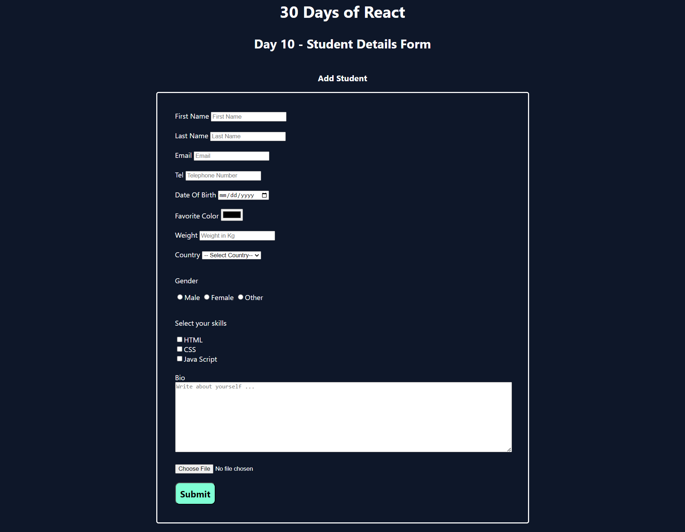

# React Forms Practice

This project is a simple React application built to practice handling forms in React. It demonstrates the use of various input elements such as text fields, checkboxes, radio buttons, select dropdowns, and file uploads within a form. The application uses functional components and React hooks to manage form state, handle form submissions, and display the collected data.

## Features

- Input fields for first name, last name, email, telephone, date of birth, weight, and bio.
- Select the dropdown for choosing a country.
- Radio buttons for gender selection.
- Checkboxes for selecting skills (HTML, CSS, JavaScript).
- Color picker for selecting a favourite colour.
- File upload functionality.
- Form data submission with a console log of the submitted data.

## Purpose

The purpose of this project is to practice the following React concepts:

- Handling forms and user inputs in React.
- Managing state with React hooks (`useState`).
- Handling form submissions.
- Mapping through arrays to generate form options dynamically.
- Conditional rendering based on form input.
